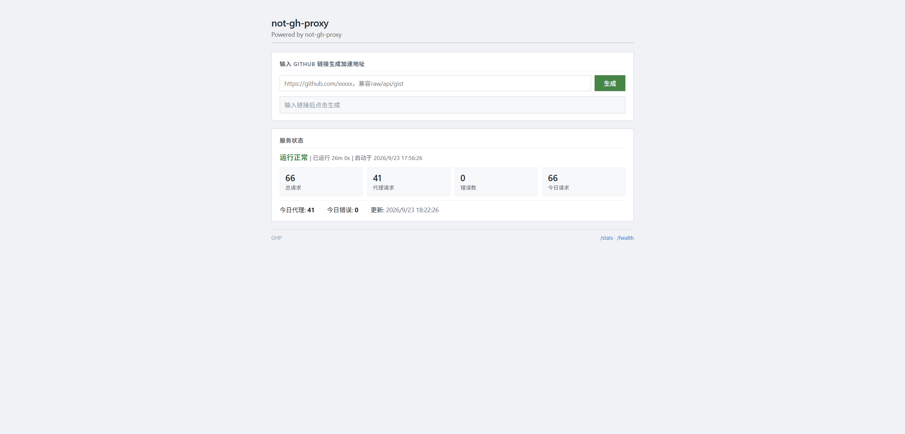

# not-gh-proxy

一个并非 GitHub 加速代理的代理服务，附带简单的前端页面和请求统计。

- 代理 GitHub 相关域名
- 可选开启开放代理（任意 URL）
- 内网地址屏蔽 和 开放代理接口自定义（防 SSRF）
- 请求统计
- 支持反向代理



## 快速开始

```bash
git clone https://github.com/hsushjk/not-gh-proxy.git
cd not-gh-proxy
npm install express axios cors
node server.js
```

若缺失 `config.json` ，则会在同目录自动生成 ，默认监听 `0.0.0.0:3000` ，自行修改后重启server

需要自行准备favicon

浏览器打开 `http://localhost:3000` 即可。

## 依赖

- Node.js 14+
- `express`、`axios`、`cors`

## 使用方式

### 1. 生成加速地址

在首页输入 GitHub 链接，点击生成。

### 2. 直接拼接路径

```
https://your-domain.com/https://github.com/user/repo
```

### 3. 查询参数

```
https://your-domain.com/?url=https://github.com/user/repo
```

### 4. 开放代理（可选）

在 `config.json` 中开启：

```json
"openProxy": {
  "enabled": true,
  "path": "1a2b3c4d",
  "blockPrivateNetwork": true
}
```

然后可以代理任意 URL：

```
https://your-domain.com/1a2b3c4d/https%3A%2F%2Fexample.com%2Ffile.zip
```

> 开放代理存在 SSRF 风险，`blockPrivateNetwork` 默认开启，会拒绝客户端请求内网地址。除非你清楚风险，否则不要关闭
> 开放代理存在 滥用 风险，`path` 不要使用默认值

## 配置文件

配置文件为同目录下的 `config.json`，不存在会自动生成。只写要改的字段即可，其余用默认值。

```json
{
  "port": 3000,
  "host": "0.0.0.0",
  "trustProxy": "",
  "site": {
    "name": "not-gh-proxy",
    "title": "not-gh-proxy",
    "subtitle": "Powered by not-gh-proxy"
  },
  "dirs": {
    "static": "./public",
    "logs": "./logs"
  },
  "log": {
    "file": true,
    "console": true,
    "keepDays": 7
  },
  "proxy": {
    "timeout": 120000,
    "maxRedirects": 5,
    "userAgent": "not-gh-proxy/1.0"
  },
  "openProxy": {
    "enabled": false,
    "path": "1a2b3c4d",
    "blockPrivateNetwork": true
  },
  "allowedDomains": [
    "github.com",
    "raw.githubusercontent.com",
    "api.github.com",
    "gist.github.com",
    "gist.githubusercontent.com",
    "avatars.githubusercontent.com",
    "desktop.githubusercontent.com",
    "codeload.github.com",
    "objects.githubusercontent.com",
    "camo.githubusercontent.com",
    "media.githubusercontent.com",
    "user-images.githubusercontent.com",
    "private-user-images.githubusercontent.com",
    "github.githubassets.com",
    "githubusercontent.com",
    "githubassets.com"
  ]
}
```

### 字段说明

| 字段 | 说明 |
|---|---|
| `port` | 监听端口 |
| `host` | 监听地址，默认 `0.0.0.0` |
| `trustProxy` | 反向代理时设为 `true` 或 `loopback`，用于获取真实 IP，反代时非常建议开启，便于审计和封禁 IP |
| `site.name` | 站点内部名称 |
| `site.title` | 页面标题 / 大标题 |
| `site.subtitle` | 标题下方副标题 |
| `dirs.static` | 静态文件目录，相对路径按 `server.js` 所在目录解析，也可以绝对 |
| `dirs.logs` | 日志目录 |
| `log.file` | 是否写日志文件 |
| `log.console` | 是否输出控制台日志 |
| `log.keepDays` | 内存中每日统计保留天数 |
| `proxy.timeout` | 上游请求超时（毫秒） |
| `proxy.maxRedirects` | 上游最大重定向次数 |
| `proxy.userAgent` | 转发给上游的 User-Agent |
| `openProxy.enabled` | 是否开启开放代理 |
| `openProxy.path` | 开放代理路径前缀 |
| `openProxy.blockPrivateNetwork` | 是否屏蔽内网地址 |
| `allowedDomains` | 允许代理的域名列表，精确匹配或子域名匹配 |

## 接口

| 路径 | 说明 |
|---|---|
| `/` | 首页 |
| `/config` | 站点配置（仅前端配置，不包含敏感信息） |
| `/health` | 健康检查 |
| `/stats` | 请求统计 |

## 部署

### 反向代理（Nginx）

```nginx
location / {
    proxy_pass http://127.0.0.1:3000;
    proxy_set_header Host $host;
    proxy_set_header X-Real-IP $remote_addr;
    proxy_set_header X-Forwarded-For $proxy_add_x_forwarded_for;
    proxy_set_header X-Forwarded-Proto $scheme;
}
```

并把 `config.json` 里的 `trustProxy` 设为 `true`，反代时非常建议开启，便于审计和封禁ip

### 反向代理到子路径

```nginx
location /proxy/ {
    proxy_pass http://127.0.0.1:3000/;
    proxy_set_header Host $host;
    proxy_set_header X-Real-IP $remote_addr;
    proxy_set_header X-Forwarded-For $proxy_add_x_forwarded_for;
    proxy_set_header X-Forwarded-Proto $scheme;
}
```

前端会自动以当前路径为 base 生成加速链接和调用接口，无需额外配置。

### 守护进程

这里以systemd为例，也同样可以supervisor

```ini
[Unit]
Description=not-gh-proxy
After=network.target

[Service]
Type=simple
WorkingDirectory=/opt/not-gh-proxy
ExecStart=/usr/bin/node /opt/not-gh-proxy/server.js
Restart=on-failure
User=www-data

[Install]
WantedBy=multi-user.target
```

## 安全类说明

- **域名白名单**：仅代理 `allowedDomains` 中的域名，使用 `URL` 解析 hostname，精确匹配或子域名匹配，无法通过 `evil.com/github.com` 之类的构造绕过。
- **内网屏蔽**：开放代理模式下默认拒绝 `localhost`、`127.0.0.0/8`、`10.0.0.0/8`、`172.16.0.0/12`、`192.168.0.0/16`、`169.254.0.0/16`、`::1`、`fc00::/7`、`fe80::/10` 等地址。
- **日志**：仅记录方法、URL、IP、状态码、耗时、UA，用于排查问题。